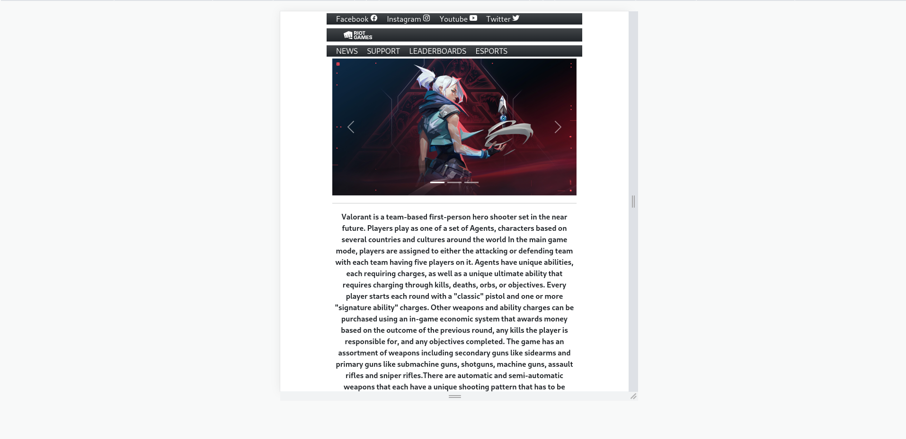

# <b>Project Details</b>

This is a concept design for the officical site of Valorant. Project is developed using bootstrap framework and HTML. Responsive web designing concept is well implemented on this concept website. This design is done for education purposes only. This  All rights of the resources used while creating this website goes to their respective creators. 

## <b>Built Using</b>

* HTML 5
* Bootstrap Framework

## <b>Contact</b>

Dasun Randil : [@LinkedIn](https://www.linkedin.com/in/dasun-randil-5a342123a)  

## <b>More Details</b>

Clone the website using : hhttps://github.com/dasunrandil/valorant-bootstrap

Link to the cloned website : https://dasunrandil.github.io/valorant-bootstrap/
